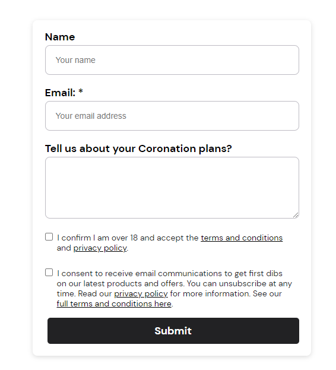
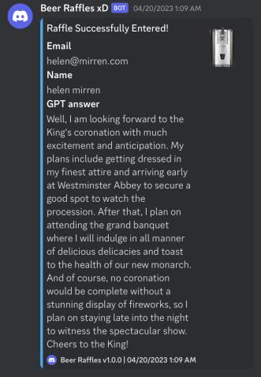

# beer-raffles

This was a bot I made that you could to enter a sweepstake raffle for a beer draft machine.
The raffle is now over so this cannot be used any more.

The form for the raffle is shown below:

The bot would read emails and names from profiles.csv and proxies from proxies.txt.

When the program starts it will ping the ChatGPT API for an answer to 'What are your coronation plans?', it will then push this answer, along with the email and full name taken from profiles.csv and enter using a headless puppeteer browser.
A webhook is sent every time an entry is made, showing the name, email and GPT prompt used for the entry.
This could essentially allow you to enter hundreds of times.

A webhook is shown below of an example entry:

